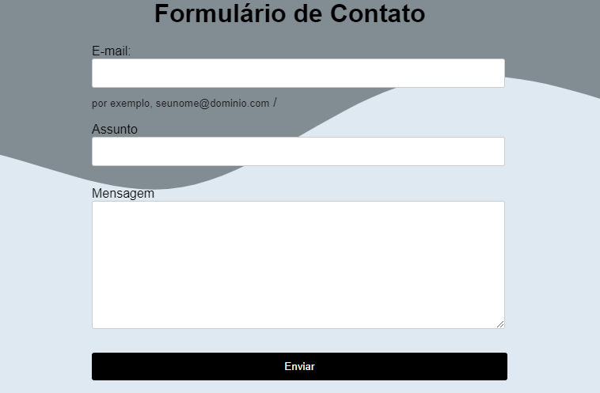

# Formulário de Contato

# Índice 
* [Descrição](#descrição-do-projeto)
* [Funcionalidade](#funcionalidade)
* [Técnicas e tecnologias utilizadas](#técnicas-e-tecnologias-utilizadas)
* [Fontes Consultadas](#fontes-consultadas)
* [Autores](#autores)

## Descrição do Projeto
Este é um projeto de página web com um formulário de contato. O formulário permite que os usuários insiram informações como o e-mail, assunto e mensagem de texto.

## Funcionalidade 
Este projeto pode ser útil em diversos contextos, como comunicação entre clientes e empresas, entregas, ou qualquer outra aplicação que envolva comunicação indireta.

## Técnicas e tecnologias utilizadas
* ``HTML5``
* ``CSS3``
* ``VsCode``
* ``Git``

## Fontes Consultadas 
* [Get Waves](https://getwaves.io/)
* [Dev Media](https://www.devmedia.com.br/customizando-formularios-com-css/37212)
* [Mdn WebDocs](https://developer.mozilla.org/en-US/docs/Web/HTML/Element/form)

## Autores
